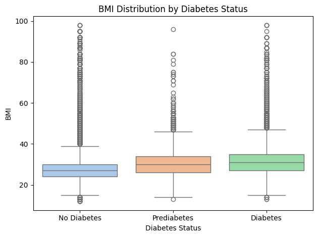

# Diabetes Prediction with Machine Learning Models


This repository contains an exploratory data analysis and the implementation of several classification models to predict a person's diabetes status based on a large-scale health survey dataset. The project aims to classify participants into three categories: no diabetes, prediabetes, or diabetes.

---

## Table of Contents
* [Project Context](#project-context)
* [Objectives](#objectives)
* [Repository Structure](#repository-structure)
* [Methodology](#methodology)
  * [1. Exploratory Data Analysis (EDA)](#1-exploratory-data-analysis-eda)
  * [2. Data Preprocessing and Preparation](#2-data-preprocessing-and-preparation)
  * [3. Modeling and Training](#3-modeling-and-training)
    * [Resampling Techniques](#resampling-techniques)
    * [Implemented Models](#implemented-models)
    * [Evaluation Metrics](#evaluation-metrics)
* [EDA](#eda)
* [Data Preprocessing and Preparation](#data-preprocessing-and-preparation)
* [Modeling and Training](#modeling-and-training)
* [Results](#results)
* [Installation and Usage](#installation-and-usage)
* [Technologies Used](#technologies-used)
* [Author](#author)

---

## Project Context

Diabetes is one of the most common chronic diseases in the United States, affecting millions of people and creating a massive economic burden. It occurs when the body cannot properly regulate blood glucose due to insufficient insulin production or ineffective use of insulin. This can lead to severe complications such as heart disease, vision loss, limb amputations, and kidney damage.

Although there is no cure, losing weight, eating healthily, staying active, and receiving medical treatments can help reduce the impact of the disease. Early diagnosis and predictive risk models are crucial for encouraging lifestyle changes and timely treatment.

According to the CDC, as of 2018, 34.2 million Americans had diabetes and 88 million had prediabetes, with many unaware of their condition. Type II diabetes is the most common form, and its prevalence varies by age, education, income, location, race, and other social factors, disproportionately affecting people with lower socioeconomic status. The economic impact is huge, with annual costs reaching around $400 billion when including undiagnosed diabetes and prediabetes.

The Behavioral Risk Factor Surveillance System (BRFSS) is a health-related telephone survey that is collected annually by the CDC. Each year, the survey collects responses from over 400,000 Americans on health-related risk behaviors, chronic health conditions, and the use of preventative services. It has been conducted every year since 1984. For this project, a csv of the dataset available on Kaggle for the year 2015 was used. This original dataset contains responses from 441,455 individuals and has 330 features. These features are either questions directly asked of participants, or calculated variables based on individual participant responses.

Find more: [Behavioral Risk Factor Surveillance System](https://www.kaggle.com/datasets/cdc/behavioral-risk-factor-surveillance-system)

The target variable we aim to predict is a column indicating the respondent's diabetes status, which is divided into three classes:

*   `0`: **No Diabetes (or only had it during pregnancy)**
*   `1`: **Prediabetes**
*   `2`: **Diabetes**

Given the inherent class imbalance in the dataset (the non-diabetic population is typically much larger than the other two combined), special attention is given to techniques for handling imbalanced data.

## Objectives

The main objectives of this project are:
*   **Analyze and visualize** the dataset to identify relevant patterns and correlations between features and diabetes status.
*   **Properly preprocess the data** to prepare it for machine learning models.
*   **Build, train, and evaluate** various classification models to predict the target variable.
*   **Compare the performance** of the models using metrics suitable for a multi-class and imbalanced classification problem.
*   **Identify the most effective model** for this prediction task.

It is important to clarify that although the main objectives are those previously mentioned, I will specifically focus on resampling techniques to deal with class imbalance and metrics to be considered for multi-class classification.

## Repository Structure

The repository is organized as follows to ensure clarity and reproducibility:

```
├── diabetes_012_health_indicators_BRFSS2015.csv  # Main dataset
│
├── images/ # README.md images
│   
├── notebook/
│   ├── EDA.ipynb  # Only the exploratory data analysis
│   └── diabetes_012_ml.ipynb  # Model training and evaluation
│
├── models/
│   ├── cat_boost_model_borderline.cbm  # Saved trained model
│   └── cat_boost_model_adasyn.cbm      # Another saved model
│
├── requirements.txt                    # Python dependencies
└── README.md                           # This file
```

## Methodology

The workflow is divided into three main phases:

### 1. Exploratory Data Analysis (EDA)

In this phase, the dataset was explored to understand the distribution of variables and their relationships. Key steps included:
*   **Target Variable Distribution**: Visualizing the number of samples per class to confirm the imbalance.
*   **Univariate Analysis**: Studying the distributions of numerical features (using histograms and boxplots) and categorical features (using bar charts).
*   **Correlation Analysis**: Using a heatmap to visualize the correlation between numerical variables and check for potential multicollinearity.
*   **Relationship with Target Variable**: Analyzing plots to understand how each feature influences the likelihood of having diabetes, prediabetes, or no diabetes.

### 2. Data Preprocessing and Preparation

Before training the models, the data was processed through the following steps:
*   **Data Cleaning**: Handling missing values (if any) and correcting data types.
*   **Categorical Variable Encoding**: There was no need to perform since the dataset we used had been previously processed. Only the target variable was adjusted to be able to process it in the models.
*   **Data Splitting**: The dataset was split into training (60%), validation (20%) and testing (20%) sets in a stratified manner to maintain the original class proportions in both sets.

### 3. Modeling and Training

This is the core phase of the project, where classification models were trained and evaluated. The models were trained pre and post resampling to see how they performed.

#### Resampling Techniques

Due to the significant class imbalance, resampling techniques were applied **only to the training set** to prevent data leakage. The techniques used were variants of **SMOTE (Synthetic Minority Over-sampling Technique)**, such as SMOTE-Tomek, SMOTE-ENN, Borderline-SMOTE and also ADASYN which, although not a technique like SMOTE, is good for handling class imbalance. These resampling techniques deal with class minorities in different ways that I will be explaining later.

#### Implemented Models

Several tree-based models, known for their high performance on tabular data, were trained and compared:
*   **Decision Tree**: As a baseline model to understand the basic decision rules.
*   **Random Forest**: An ensemble model that combines multiple decision trees to improve robustness and reduce overfitting.
*   **XGBoost (Extreme Gradient Boosting)**: A highly optimized and efficient gradient boosting model.
*   **LightGBM**: Another gradient boosting implementation that is faster and uses less memory than XGBoost, especially on large datasets.
*   **CatBoost**: A gradient boosting model that handles categorical features natively and is robust to overfitting.

#### Evaluation Metrics

Since accuracy is not a reliable metric for imbalanced problems, a more comprehensive set of metrics was used:
*   **Confusion Matrix**: To visualize the classification performance, including correct and incorrect predictions for each of the three classes.
*   **Precision, Recall, and F1-Score**: The F1-Score was calculated using both a `weighted avg` and a `macro avg`. The weighted average accounts for class imbalance, while the macro average gives equal importance to each class, which is useful for assessing performance on minority classes.
*   **Classification Report**: A comprehensive summary from Scikit-learn that includes Precision, Recall, and F1-Score per class.
*   **AUC-PR Score**: For this multi-class problem, the One-vs-Rest (OvR) strategy was used to calculate the area under the AUC-PR curve.

---

## EDA

### Target Variable Distribution

We can observe that 84% of our participants do not have diabetes (or only had it during pregnancy), 14% have diabetes and almost 2% have prediabetes. The dataset has a case of imbalance that we need to consider when applying the models.


### Univariate Analysis

56% of the participants are females while the other 44% are males.


The proportion of diabetes status is similar in both females and males.


Almost 58% of the participants have low-normal high cholesterol level.


8% of participants without high cholesterol have diabetes while 22% of participants with high cholesterol level have diabetes. This appears to be an important factor.


Tha majority of participants are no smokers.


If we look at how this variable behaves in terms of diabetes status we can see that 12% of non-smokers have diabetes while 16% of smokers have diabetes. This could be considered an important variable although not as important as others. This could be more related to the habits of the participant.


In terms of age groups, among the participants the age groups between 50 and 74 years dominate.


| Age Group | Range (Age) |
|-----------|-------------|
| 1         | 18-24       |
| 2         | 25-29       |
| 3         | 30-34       |
| 4         | 35-39       |
| 5         | 40-44       |
| 6         | 45-49       |
| 7         | 50-54       |
| 8         | 55-59       |
| 9         | 60-64       |
| 10        | 65-69       |
| 11        | 70-74       |
| 12        | 75-79       |
| 13        | +80         |

If we analyse the diabetes status by age group we can see that as the age group increases the proportion of participants with diabetes increases, which is to be expected. Those with the highest proportion of diabetic participants are the participants between 70 and 80 years of age.


Analysing the distribution of the variable BMI (body mass index) we notice that it is higher for those with diabetes or pre-diabetes, so we are talking about another important factor.




### Correlation Analysis

From the correlation matrix it can be seen that there is a positive relationship between diabetes status and the variables general health, physical activity and walking difficulties. This makes sense and shows that these are variables that could become important when developing a prediction model.


### Relationship with Target Variable

In the case of how participants perceived general health there is a clear trend showing that those who perceive better health do not have diabetes while those who perceive poor health tend to have pre-diabetes or diabetes.


The same as above can be seen in the variables of physical activity and vegetables/fruits (participants who include these products in their diet). 


Comparing body mass index with age groups and segmenting them by diabetes status it can be deduced that middle-aged groups have higher body mass while older groups have lower body mass but still have a higher proportion of diabetic participants.


---

## Data Preprocessing and Preparation

It is important to note that the dataset used was previously cleaned by a user of Kaggle, if you want to find the raw dataset you can find it here [Behavioral Risk Factor Surveillance System](https://www.kaggle.com/datasets/cdc/behavioral-risk-factor-surveillance-system).

The first thing we did was to load the dataset and look at its composition to check if it was indeed previously cleaned. You can see that there are 253,680 rows and 22 columns (including the target variable).

We notice that there are 23,899 duplicate rows. While this is a high number of duplicate data, the raw dataset contained about 500,000 rows so in this case we are going to assume that it is just a coincidence as we are not certain that these duplicate rows are an error.

After having done the EDA to understand a bit more about our dataset, we proceed to perform the data separation by creating 3 new datasets corresponding to the training, validation and test of the models.

### Variables

| Variable | Description|
|----------|------------|
| ```diabetes_012``` | Diabetes Status (0: No Diabetes, 1: Prediabetes, 2: Diabetes) [Target]|
|```highbp``` | High Blood Pressure (0: No, 1: Yes)|
|```highchol``` | High Cholesterol (0: No, 1: Yes)|
|```cholchek``` | Cholesterol check in the last 5 years (0: No, 1: Yes)|
|```bmi``` | Body Mass Index|
|```smoker``` | Have you smoked at least 100 cigarettes in your entire life? (0: No, 1: Yes)|
|```heartdiseaseorattack``` | Coronary Heart Disease (CHD) or Myocardial Infarction (MI) (0: No, 1: Yes)|
|```physactivity``` | Physical Activity in past 30 days - not including job (0: No, 1: Yes)|
|```fruits``` | Consume Fruit 1 or more times per day (0: No, 1: Yes)|
|```veggies``` | Consume Vegetables 1 or more times per day (0: No, 1: Yes)|
|```hvyalcoholconsump``` | Heavy drinkers (adult men having more than 14 drinks per week and adult women having more than 7 drinks per week) (0: No, 1: Yes)|
|```anyhealthcare``` | Have any kind of health care coverage, including health insurance, prepaid plans such as HMO, etc. (0: No, 1: Yes)|
|```nodocbccost``` | Was there a time in the past 12 months when you needed to see a doctor but could not because of cost? (0: No, 1: Yes)|
|```genhlth``` | Would you say that in general your health is: scale 1-5 1 = excellent 2 = very good 3 = good 4 = fair 5 = poor|
|```menhlth``` | Now thinking about your mental health, , which includes stress, depression, and problems with emotions, for how many days during the past 30 days was your mental health not good? (1-30) |
|```physhlth``` | Now thinking about your physical health, which includes physical illness and injury, for how many days during the past 30 days was your physical health not good? (1-30)|
|```diffwalk``` | Do you have serious difficulty walking or climbing stairs? (0: No, 1: Yes)|
|```sex``` | 0: Female, 1: Male|
|```age``` | Age Group 1 to 13 (1: 18-24,..., 9: 60-64,..., 13: +80)|
|```education``` | Scale 1-6 (1: Never attended school or only kindergarten,..., 6: College)|
|```income``` | Scale 1-8 (1: less than $10,000,..., 5: less than $35,000,..., 8: +$75,000)|

---

## Modeling and Training

When faced with a tabular dataset for a multiclass classification problem, the path to a robust model can seem daunting.

### Models

#### Decision Tree

Starting with a single **Decision Tree** is an excellent strategy for establishing a baseline model. It's the fundamental building block for all the more complex models that follow.

Unlike models such as SVMs or Logistic Regression, decision trees do not require feature scaling (e.g., standardization or normalization). They are also robust to outliers. They can inherently capture non-linear relationships between features and the target variable without requiring manual transformations like polynomial features.

However, their main drawback is a high tendency to overfit the training data. A single tree can grow very deep, memorizing the noise in the data rather than learning the general signal. Through the search and selection of hyperparameters we try to find models that can make better predictions, always taking into account not to fall into overfitting.

#### Random Forest

**Random Forest** is an ensemble method that directly addresses the overfitting problem of single Decision Trees. It does so by combining the wisdom of many "weaker" trees into a single, robust model.

It creates multiple random subsamples of the training data (with replacement). A separate Decision Tree is trained on each subsample. At each split in a tree, only a random subset of features is considered. This prevents strong predictors from dominating all the trees, leading to more diverse and decorrelated models.

Between the key advantages of RF models we can highlight the reduction of the variance model by averaging the predictions. Another important advantage is the improved accuracy (almost always outperforms a single Decision Tree). We can also tune a larger number of hyperparameters.

#### XGBoost 

While Random Forest builds trees independently and in parallel, Gradient Boosting models like **XGBoost (Extreme Gradient Boosting)** build them sequentially. Each new tree is trained to correct the errors made by the previous ones. It is an optimized and highly efficient implementation of the Gradient Boosting algorithm.

It often delivers state-of-the-art results on tabular data by focusing on the "hard-to-classify" examples. It also includes L1 (Lasso) and L2 (Ridge) regularization terms in its objective function, which helps control model complexity and prevent overfitting. It is optimized for performance, with features like parallelized tree building and cache-aware access and has built-in capabilities to handle missing values.

#### LightGBM and CatBoost

As datasets grow larger (like ours), even XGBoost can become computationally expensive. LightGBM and CatBoost are modern gradient boosting frameworks designed to be faster and more efficient, each with its unique strengths.

**LightGBM (Light Gradient Boosting Machine)**, developed by Microsoft, prioritizes training speed and efficiency. It uses a leaf-wise tree growth strategy instead of the traditional level-wise growth of XGBoost. This means it grows the tree where it will result in the largest reduction in loss, making it much faster and more memory-efficient. This type of models are the best for scenarios where training speed is critical, especially with very large datasets (millions of rows).

**CatBoost (Categorical Boosting)**, developed by Yandex, excels at handling categorical data automatically and effectively. It's standout feature is its sophisticated, built-in handling of categorical features. It uses an algorithm based on ordered boosting and target statistics to encode categorical variables without the risk of target leakage, a common problem with traditional encoding methods. This type of models are the best for datasets with many categorical features (e.g., user IDs, product categories). It often delivers excellent results with minimal hyperparameter tuning, making it very user-friendly.

### Class Imbalance

In our dataset we face a significant challenge of class imbalance, where the classes 1 and 2 have far fewer samples (minority classes) than the class 0 (majority class). If left unaddressed, most machine learning models will become biased towards the majority class, achieving high accuracy simply by ignoring the rare, often more critical, minority classes.

Resampling techniques are designed to mitigate this by balancing the class distribution in the training data. We will be exploring a progression from the foundational SMOTE to more sophisticated adaptive methods.

**It is important to note that these resampling techniques should only be applied to the training dataset and not to the validation and test datasets, as this would adulterate the entire dataset and the results we would obtain would be incorrect and biased.**

I highlight this because I have seen numerous works and resolutions on this dataset where they apply resampling before splitting the dataset, and therefore, creating ‘very good’ models that end up being useless in reality.

#### SMOTE

**SMOTE** is the most widely known and used over-sampling technique. Instead of simply duplicating existing minority samples (which adds no new information), SMOTE creates new, synthetic samples. It selects a minority class sample at random and it finds its k-nearest neighbors from the same minority class. It randomly chooses one of these neighbors and it generates a new synthetic sample at a random point along the line segment connecting the original sample and its chosen neighbor.

While effective, applying SMOTE directly can be problematic, especially on very large datasets:

* Noise Generation: SMOTE does not consider the position of majority class samples. If a minority sample is an outlier or located in a noisy area, SMOTE can generate synthetic samples "in the wrong place" blurring the natural decision boundary between classes and potentially making the classification task even harder.
* Computational Cost: Finding the k-nearest neighbors for every minority sample in a dataset with millions of rows is computationally intensive and can drastically slow down the training pipeline.
* Indiscriminate Synthesis: It generates the same number of synthetic samples for every minority point, regardless of whether that point is in a "safe" region or a "difficult" one on the border with another class.

These limitations led to the development of more refined hybrid and adaptive techniques.

#### SMOTE + Undersampling (Tomek Links and Edited Nearest Neighbors)

To address the noise issue, SMOTE is often combined with undersampling techniques that "clean" the data after over-sampling. These methods remove samples that are likely to be noise or that clutter the decision boundary.

A **Tomek Link** exists between two samples of different classes if they are each other's nearest neighbor. These links often highlight noisy or borderline instances. After applying SMOTE to generate new minority samples, the Tomek Links algorithm is used to identify these pairs. The sample from the majority class in each link is then removed. This helps to clean the space between classes, creating a clearer decision boundary.

**Edited Nearest Neighbors (ENN)** is a more aggressive cleaning method. It looks at the k-nearest neighbors for each sample. If a sample's class label does not agree with the majority of its neighbors, that sample is removed. When combined with SMOTE, ENN removes both majority and synthetic minority samples that are deemed to be misclassified by their local neighborhood. This results in a much "cleaner" dataset, though at the risk of removing useful information.

#### Borderline-SMOTE

Instead of cleaning after the fact, **Borderline-SMOTE** improves the synthesis process itself. It recognizes that not all minority samples are equally important. The ones on the "border" of a class are most critical for defining the decision boundary.

It first identifies all minority samples that are "on the border" (i.e., where a significant number of their neighbors belong to a majority class). It then applies the SMOTE algorithm only to these borderline samples.

This focuses the synthetic data generation where it is most needed, strengthening the decision boundary without adding potentially unhelpful samples deep within the minority class region.

#### ADASYN

**ADASYN (Adaptive Synthetic Sampling)** takes the concept a step further. Like Borderline-SMOTE, it focuses on the "harder" samples, but it does so in an adaptive manner.

It calculates a ratio for each minority sample, representing the proportion of majority class samples in its neighborhood. This ratio serves as a measure of how "difficult" that sample is to learn. It then generates a weighted number of synthetic samples for each minority point: more synthetic data is generated for the minority samples that are harder to learn (i.e., those with a higher proportion of majority neighbors).

The key difference from SMOTE is that ADASYN adaptively shifts the decision boundary to focus on difficult-to-classify examples, making it a very powerful technique for highly imbalanced and complex datasets.

---

## Results

The models were evaluated on the test set (which was not seen during training or resampling). Below is a summary table of the results obtained (use your own values):

| Model           | F1-Score (Weighted) | F1-Score (Macro) | Weighted AUC-PR |
|-----------------|---------------------|------------------|-----------------|
| Decision Tree   | 0.81                | 0.39             | 0.86            |
| Random Forest   | 0.80                | 0.37             | 0.87            |
| Random Forest (Weight-Adj)  | 0.75    | 0.42             | 0.87            |
| Random Forest (SMOTE-Tomek)| 0.79     | 0.44             | 0.86            |
| XGBoost         | 0.81                | 0.40             | 0.87            |
| LightGBM        | 0.81                | 0.44             | 0.86            |
| CatBoost (SMOTE-Tomek)| **0.82**      | **0.45**         | **0.86**        |
| CatBoost (Borderline-SMOTE)| 0.82     | 0.44             | 0.86            |
| CatBoost (ADASYN)| 0.82               | 0.44             | 0.86            |

**Conclusion**: The **CatBoost** model with SMOTE-Tomek resampling demonstrated the best overall performance, achieving the highest F1-Score (Weighted and Macro) and Weighted AUC-PR Curve. Although the accuracy of the model in predicting the majority class is above 90%, it fails to predict class 1 (2% of the dataset) and although resampling and feature importance techniques help to improve the prediction of class 2 (14% of the dataset), it is still far from what could be considered useful.

The imbalance of class 1 (pre-diabetes) is too large (42x less data), which is why even implementing different resampling techniques does not make a substantial difference. By applying weights to models, they begin to predict the minority class at the cost of greatly diminishing the effectiveness of predicting the majority class.

Another way to approach the problem is to divide the target variable into class 0 (diabetes) and class 1 (prediabetes + diabetes). A model could then be built to predict between the pre-diabetes and diabetes classes.

---

## Installation and Usage

To replicate this project, follow these steps:

1.  **Clone the repository:**
    ```bash
    git clone https://github.com/tomasdimeo/diabetes_multiclass_classification_ml.git
    cd diabetes_multiclass_classification_ml
    ```

2.  **Create a virtual environment (recommended):**
    ```bash
    python -m venv venv
    source venv/bin/activate  # On Windows, use: venv\Scripts\activate
    ```

3.  **Install the dependencies:**
    ```bash
    pip install -r requirements.txt
    ```

4.  **Run the notebooks:**
    Open Jupyter Lab or Jupyter Notebook and run the notebooks in the suggested numerical order:
    *   `notebooks/EDA.ipynb`
    *   `notebooks/diabetes_012_ml.ipynb`

---

## Technologies Used

*   **Python 3.9**
*   **Pandas & NumPy**: For data manipulation and analysis.
*   **Matplotlib & Seaborn**: For data visualization.
*   **Scikit-learn**: For preprocessing, modeling, and evaluation.
*   **Imbalanced-learn**: For resampling techniques like SMOTE.
*   **XGBoost, LightGBM, CatBoost**: For the gradient boosting models.
*   **Tqdm**: For creating fast, extensible progress bars for loops and iterables
*   **Jupyter Notebook**: For interactive code development.

Different AI models have been used in the project to build text structures in order to make it easier for users to understand the concepts. The prediction models have been built by the author using different learned techniques as inspiration, which are detailed in the Jupyter Notebook. If you have any questions please do not hesitate to contact me.

---

Special recognition for the [Machine Learning Zoomcamp Course](https://github.com/DataTalksClub/machine-learning-zoomcamp/tree/master) from **DataTalksClub** who inspired me to carry out this machine learning project and many more to come. I recommend checking out the course if you are interested in learning more about data science.

---

## Author

*   **Tomás Di Meo**
*   **LinkedIn**: `https://www.linkedin.com/in/tom%C3%A1s-di-meo-b2689a139/`
*   **GitHub**: `https://github.com/tomasdimeo`
